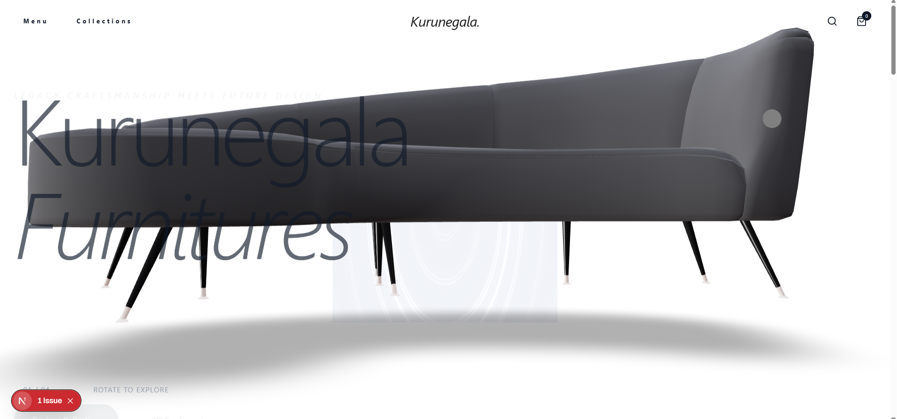
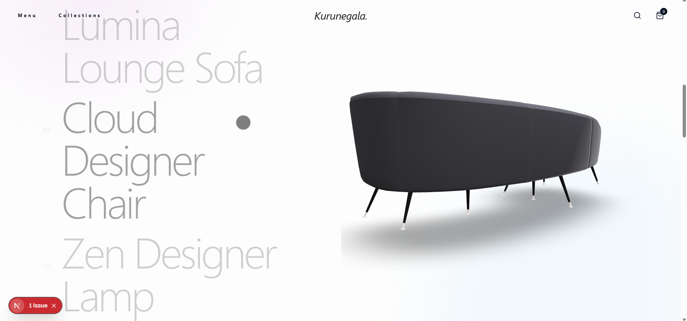
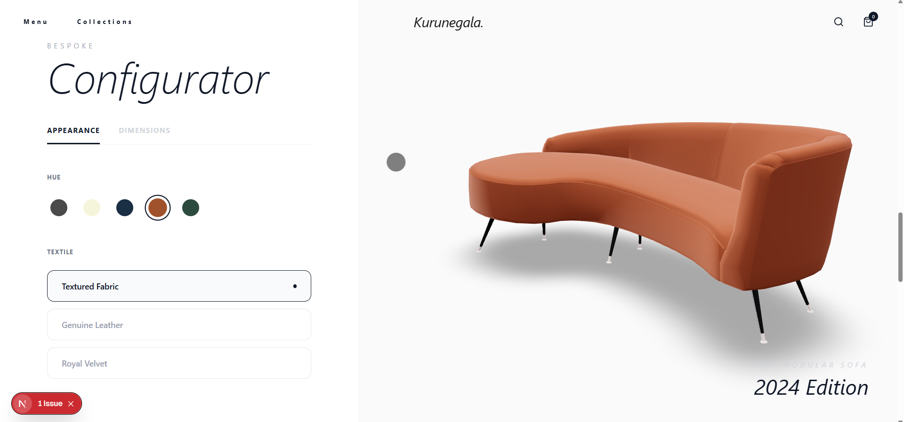
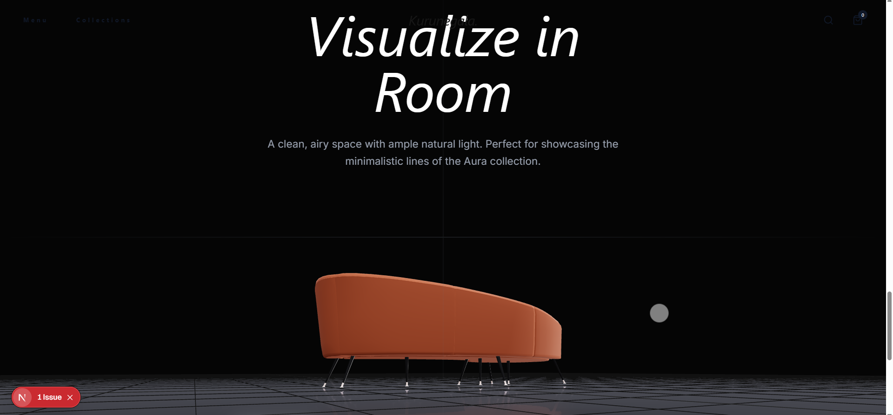
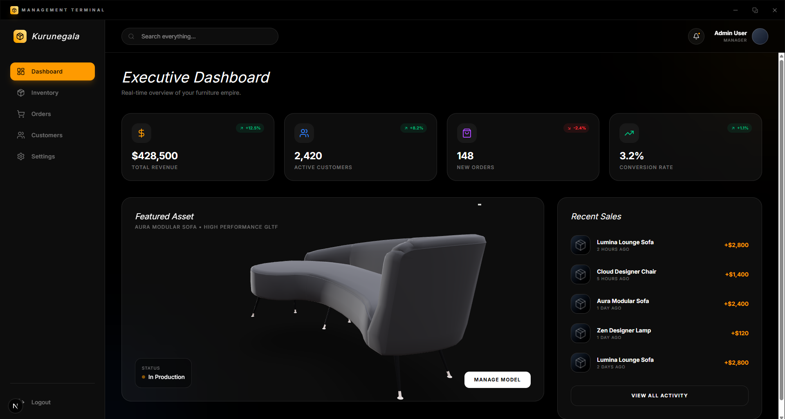
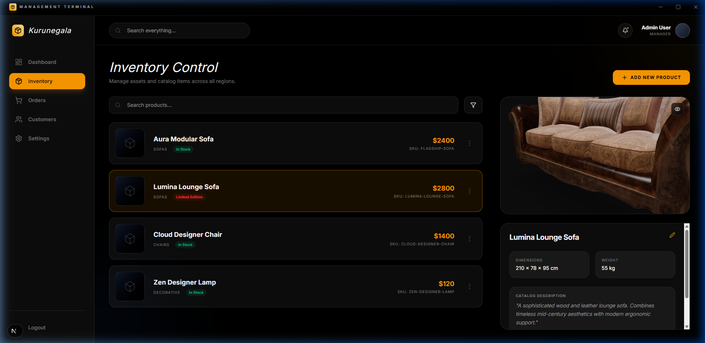

  
  
  
  
  
  
  
  
  

# 🧩 Kurunegala Furnitures

> **Immersive 3D Experience for Modern Furniture**

Kurunegala Furnitures is a **Fullstack Web Application and Desktop Admin Portal** designed to **revolutionize how customers visualize and purchase luxury furniture**.

The system focuses on **real-time 3D rendering and high-performance WebGL integrations** and aims to **provide an unparalleled, true-to-life pre-purchase visualization experience for users**.

---

# ✨ Key Features

| Feature | Description |
|---|---|
| 🛋️ **Immersive 3D Configurator** | Customize real-time WebGL product models (colors, materials) via `react-three/fiber` |
| 🖼️ **Room Visualizer** | Place furniture in various room environments and presets with high-performance shaders |
| 📊 **Desktop Admin Terminal** | Dedicated ElectronJS desktop application for secure, real-time inventory and sales management |
| ⚡ **Fluid Animations** | High-fidelity scrolling and interactive states powered by `framer-motion` and `gsap` |
| 🎨 **Admin Executive Dashboard** | D3-powered analytics, recent sales activity, and live 3D asset previews for administrators |

---

# 🎬 Project Demonstration

The following resources demonstrate the system's behavior:

- 📹 [Product walkthrough video](#-product-video)
- 📸 [Screenshots of key features](#-screenshots)
- 📄 [System architecture overview](#-architecture-overview)
- 🧠 [Engineering lessons](#-engineering-lessons)
- 🔧 [Design decisions](#-key-design-decisions)
- 🗺️ [Roadmap](#-roadmap)
- 🚀 [Future improvements](#-future-improvements)
- 📄 [Documentation](#-documentations)
- 📝 [License](#-license)
- 📩 [Contact](#-contact)

If deeper technical access is required, it can be provided upon request.

---

# 📹 Product Video

> **[DEMONSTRATION PENDING]**

*A comprehensive video or GIF of the system's walkthrough demonstrating the Architecture, 3D engines, and core workflows is available soon!*

---

# 📸 Screenshots

### User Storefront
**Home & 3D Model:**

**Collections:**

**3D Configurator:**

**Room Visualizer:**

---

### Admin Terminal
**Executive Dashboard:**

**Inventory Manager:**

---

# ⚙️ Architecture Overview

Kurunegala Furnitures is implemented using a **Hybrid Next.js Web App / Electron Application Architecture**. 
The system follows a **Modular, Component-Based layered pattern**:
1. **Presentation Layer:** 
2. **State Layer:** 
3. **Data Access & API Layer:** 
4. **Desktop Containerization Layer:** 
5. **Logic Layer:** 

### Frontend (Storefront & Admin Views)
- **Next.js 16 (App Router)** - Server-side rendering and routing
- **React Three Fiber / Drei** - WebGL 3D rendering pipeline
- **Tailwind CSS & Framer Motion** - Utility styling and animation micro-interactions
- **Zustand** - Global state management for 3D configurators

### Backend
- **Next.js API Routes** - Dedicated serverless endpoints (`/api/products`)
- **JSON Data Layer (Mocking future MSSQL)** - Real-time file system CRUD via `fs/promises`
- **Node.js**
- **MSSQL** - Future database integration

### Desktop App Container
- **Electron.js** - Wraps the Next.js local server for dedicated admin desktop usage
- **Concurrently & Wait-on** - Start sequence orchestration

### Local Persistence
- **Local File System / `data.json`** - Handled server-side to prevent client tampering

---

# 🧠 Engineering Lessons

- **Mastering the Hybrid Monolith:** Orchestrating a single codebase for both web and desktop (Electron) contexts.
- **WebGL Optimization & Performance:** Optimizing 3D models with `useMemo` and concurrent rendering to maintain high FPS.
- **Unified Codebase (Web & Desktop):** Sharing core business logic and state between public and admin environments.
- **Custom Shaders & Visual Fidelity:** Implementing high-performance atmospheric visuals via raw Three.js shaders.
- **Complex UI/UX Synchrony:** Coordinating `Zustand`, `Framer Motion`, and WebGL for a seamless interactive feel.
- **Windows MAX_PATH Limits & Bundling:** Addressing Windows-specific path limits to ensure reliable deployment.

*For a detailed breakdown of technical challenges and solutions, see [docs/engineering_lessons.md](docs/engineering_lessons.md).*

---

# 🔧 Key Design Decisions

1. **Next.js App Router vs. External Node Server:** Monolithic core for reduced latency and infrastructure overhead.
2. **Electron for Admin Terminal:** Dedicated desktop shell for enhanced security and focused admin UX.
3. **Zustand Over React Context API:** High-performance state management for demanding 3D rendering.
4. **JSON File System as Initial Data Layer:** Abstracted `lib/db.ts` for immediate portability and future MSSQL migration.
5. **Modular, Layered Folder Architecture:** Strict separation of Presentation, State, Logic, and Data.

*For more in-depth rationale, see [docs/design_decisions.md](docs/design_decisions.md).*

---

# 🗺️ Roadmap

Key upcoming features planned for Kurunegala Furnitures:

- ✅ **DONE** — Core 3D engine integration and GLB loaders
- ✅ **DONE** — Rebranding and initial application structure 
- 🔄 **IN PROGRESS** — MSSQL Database integration replacing local JSON
- ⏳ **NOT STARTED** — Stripe Payment Gateway Checkout
- ⏳ **NOT STARTED** — Admin Order Fulfilment Workflows

---

# 🚀 Future Improvements

Planned enhancements include:

- Multi-environment staging support (Vercel edge for Web, local secure server for Electron DB).
- Procedural texture generation for 3D materials.
- Role Based Access Control (RBAC) securely locked inside the Electron IPC bridge.

---

## 📄 Documentations

Additional documentation is available in the `docs/` folder:

| File | Description |
|---|---|
| ["Architecture & Design"](docs/architecture.md) | Granular breakdown of the system components and data flow. |
| ["Feature Specifications"](docs/features.md) | Details on WebGL tools, configurators, and admin terminal functionalities. |
| ["Engineering Lessons"](docs/engineering_lessons.md) | Detailed technical challenges and performance optimization strategies. |
| ["Design Decisions"](docs/design_decisions.md) | In-depth rationale for architectural and technical choices. |

---

# 📝 License

This repository is published for **portfolio and educational review purposes**.

The source code may not be accessed, copied, modified, distributed, or used without explicit permission from the author.

© 2025 Viraj Tharindu — All Rights Reserved.

---

# 📩 Contact

If you are reviewing this project as part of a hiring process or are interested in the technical approach behind it, feel free to reach out.

I would be happy to discuss the architecture, design decisions, or provide a private walkthrough of the project.

**Opportunities for collaboration or professional roles are always welcome.**

📧 Email: virajtharindu1997@gmail.com  
💼 LinkedIn: [viraj-tharindu](https://www.linkedin.com/in/viraj-tharindu/)  
🌐 Portfolio: [vjstyles.com](https://vjstyles.com/)  
🐙 GitHub: [VirajTharindu](https://github.com/VirajTharindu)  

---

  <em>Visualizing the Future of Furniture E-commerce</em>

